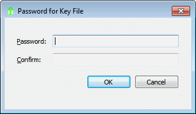

#Chiffrer un fichier binaire tel qu'une image ou un fichier compressé

## Générer un nouveau fichier clé si vous souhaitez utiliser un fichier clé pour le chiffrement.

1\. Cliquer sur le bouton « Générer une clé ».

 

2\. Sélectionner le bouton radio « Clé dans le dépôt » et saisir `ma_nouvelle_clé` dans la boîte de texte correspondante et cliquer sur OK.

3\. Il vous sera demandé de saisir une phrase de passe pour protéger le fichier clé sur le disque.

4\. Cliquer sur **Non**, car cela s'applique à un texte et que nous chiffrons des fichiers binaires.

## Chiffrer un fichier binaire

5\. Cliquer sur le bouton « Chiffrement de fichier »

6\. Cliquer sur « Parcourir... »  pour sélectionner un fichier d'entrée.

 

7\. Select an input file and click OK. The output file name and location will be suggested by adding `.epd` extension to your input file path (see the first image below). **IMPORTANT: to ensure that your output file is compatible with OpenGPG, change the extension from `.epd` to `.gpg` (see the second image below). Note that only `.epd` file with passphrase protection is compatible with OpenPGP.**

8\. If you want to use a key file, specify it in the Key File Path text box by clicking Select Key... button. Note that either a passphrase or key file should be used for GPG type and not both.

File without path is looked for in the EncryptPad directory first and then in the repository in HOME (see the text in the picture above). If your key is not in the repository, you can specify a full path to your key. 

`Persist key location in encrypted file` is not supported for GPG files (see README.md). Leave it blank for now. TODO:add the link to the EPD double encryption manual.

9\. Click Start

If you have not set a passphrase and key file, EncryptPad will ask you to enter one.

10\. If encryption succeeds, you will see the following message.

