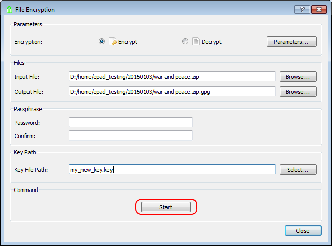

#Chiffrer un fichier binaire tel qu'une image ou un fichier compressé

## Générer un nouveau fichier clé si vous souhaitez utiliser un fichier clé pour le chiffrement.

1\. Cliquez sur le bouton « Générer une clé ».

 

2\. Sélectionnez le bouton radio « Clé dans le dépôt » et saisir « ma_nouvelle_clé » dans la boîte de texte correspondante et cliquer sur OK.

3\. Il vous sera demandé de saisir une phrase de passe pour protéger le fichier clé sur le disque.

4\. Cliquez sur **Non**, car cela s'applique à un texte et que nous chiffrons des fichiers binaires.

## Chiffrer un fichier binaire

5\. Cliquez sur le bouton « Chiffrement de fichier »

6\. Cliquez sur « Parcourir... » pour sélectionner un fichier d'entrée.

 

7\. Sélectionnez un fichier d'entrée et cliquez sur OK. Le nom et l'emplacement du fichier de sortie seront suggérés en ajoutant l'extension « .epd » au chemin de votre fichier d'entrée (voir la première image ci-dessous). **IMPORTANT : pour garantir que le fichier de sortie est compatible avec OpenGPG, l'extension doit être changée de « .epd » à « .gpg » (voir la seconde image ci-dessous). Notez que seuls les fichiers « .epd » avec une protection par phrase de passe sont compatibles avec OpenPGP.**

8\. Si vous souhaitez utiliser un fichier clé, indiquez-le dans la zone de texte « Chemin du fichier clé » en cliquant sur le bouton « Sélectionner un fichier clé ». Notez qu'une phrase de passe ou un fichier clé doit être utilisé pour le type GPG, mais pas les deux.

Les fichiers sans chemin sont d'abord cherchés dans le répertoire d'EncryptPad, puis dans le dépôt du dossier personnel (voir le texte de l'image ci-dessus). Si votre clé ne se trouve pas dans le dépôt, vous pouvez indiquer le chemin complet vers votre clé. 

L'« emplacement de clé persistant dans le fichier chiffré » n'est pas pris en charge pour les fichiers GPG (voir README.md). Laissez vide pour l'instant. À FAIRE : ajouter le lien vers le guide sur le double chiffrement  EPD.

9\. Cliquez sur Lancer

Si vous n'avez pas défini une phrase de passe ou un fichier clé, EncryptPad vous demandera dans saisir un.

10\. Si le chiffrement réussi, le message suivant apparaît :

