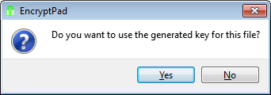
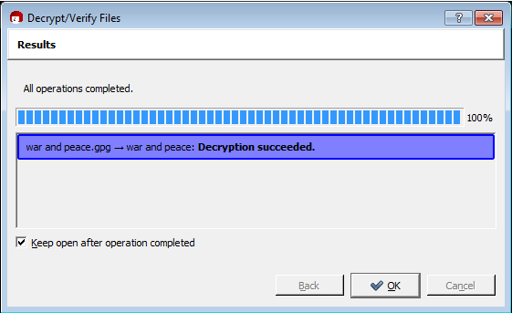

# Ouvrir un fichier texte en clair, le protéger par fichier clé et l’enregistrer comme fichier GPG

## Ouvrir un fichier texte en clair

1\. Cliquer sur le bouton «&nbsp;Ouvrir un fichier&nbsp;».

2\. Sélectionner le type de fichier texte en clair et cliquer sur le bouton Enregistrer.

3\. Le fichier texte en clair ouvert.

EncryptPad est maintenant en mode texte en clair non protégé. Elle fonctionne comme un éditeur de texte ordinaire.

## Générer un nouveau fichier

4\. Cliquer sur le bouton «&nbsp;Générer une clé&nbsp;».

5\. Sélectionner le bouton radio «&nbsp;Clé dans le dépôt&nbsp;», saisir « ma_nouvelle_clé » dans la boîte de texte correspondante et cliquer sur OK.

6\. Il vous sera demandé de saisir une phrase de passe pour protéger le fichier clé sur le disque.

Saisir « MdpClé »

7\. Cliquer sur Oui pour utiliser le nouveau fichier clé pour chiffrer votre texte.

8\. Le fichier clé se trouve dans votre répertoire personnel sous « encryptpad ».

Voici le contenu du fichier (il sera différent pour vous, car la clé est aléatoire) :  

    -----BEGIN PGP MESSAGE-----
    
    ww0ECQMIwHjM/7M8CP1g0lwBTWLhkWz6OgNJ++rjgwES+WIWttapxGFG76nANeuC
    FtCIN9xGbsFFm1g9iJRxMgWlUz9s97+tC7PVhxgCDTsfbfbFA54UAdRClR0hqoPA
    S27p6/6u5ztvfGWGrw==
    =bXn9
    -----END PGP MESSAGE-----

C’est une séquence aléatoire en Base64 à partir de laquelle la clé de chiffrement est dérivée. Elle est chiffrée avec la phrase de passe du fichier clé que vous avez fournie et peut aussi être déchiffrée avec GnuGPG. Si [Gpg4Win](https://www.gpg4win.org/) est installé, vous pouvez cliquer à droite sur le fichier dans l’explorateur Windows et choisir «&nbsp;Plus d’options GpgEX&nbsp;» et «&nbsp;Déchiffrer&nbsp;». Saisir « MdpClé » comme phrase de passe et gpg déchiffrera le fichier et créera ma_nouvelle_clé_.key.out. Le contenu du fichier sera semblable à ce qui suit :

    T6/vlnb0aysdr+xUriwwwrC844iVImiG4T/sCgF+ETQ=

## Protéger avec le fichier clé et enregistrer comme fichier GPG

9\. Cliquer sur le bouton «&nbsp;Enregistrer sous&nbsp;».

10\. Sélectionner le type de fichier GnuPG et cliquer sur le bouton Enregistrer.

Veuillez prendre note que le nom de fichier est maintenant « guerre et paix.gpg » dans la boîte de dialogue «&nbsp;Enregistrer sous&nbsp;».

11\. Le fichier a maintenant été enregistré sur le disque, chiffré avec le fichier clé généré. Voir l’état dans l’image ci-dessous.

## Le fichier GPG sur le disque

C’est un fichier OpenPGP. Vous pouvez l’envoyer à quelqu’un qui n’utilise pas EncryptPad. Il peut être déchiffré facilement avec [Gpg4Win](https://www.gpg4win.org/). Utiliser le contenu de ce fichier clé comme phrase de passe « T6/vlnb0aysdr+xUriwwwrC844iVImiG4T/sCgF+ETQ= » (voir étape 8).   

Sortie de la commande --list-packets du paquet GPG :

    gpg --list-packets "guerre et paix.gpg"
    
    :symkey enc packet: version 4, cipher 9, s2k 3, hash 8
            salt 1c73cc8df90a54d5, count 65536 (96)
    gpg: AES256 encrypted data
    :encrypted data packet:
            length: 1201175
            mdc_method: 2
    gpg: encrypted with 1 passphrase
    :compressed packet: algo=2
    :literal data packet:
            mode t (74), created 0, name="CONSOLE",
            raw data: unknown length

## Visualiser ou changer le fichier clé utilisé comme protection

12\. Cliquer sur le bouton «&nbsp;Définir la clé&nbsp;».

13\. Visualisez le fichier clé sélectionné dans la boîte de dialogue «&nbsp;Définir la clé&nbsp;».

Les fichiers sans chemin sont d’abord cherchés dans le répertoire d’EncryptPad, puis dans le dépôt du dossier personnel (voir le texte de l’image ci-dessus). Si votre clé ne se trouve pas dans le dépôt, vous pouvez indiquer le chemin complet vers votre clé. 

L’«&nbsp;emplacement de clé persistante dans le fichier chiffré&nbsp;» n’est pas pris en charge pour les fichiers GPG (voir README.md). Laissez vide pour l’instant. À FAIRE : ajouter le lien vers le guide sur le double chiffrement EPD.

## Ouvrir un autre fichier texte en clair

Si vous tentez d’ouvrir un fichier texte en clair maintenant, cela échouera avec le message suivant :

EncryptPad pense que le fichier est chiffré avec un fichier clé, car son mode est «&nbsp;Protégé par une clé&nbsp;», comme vous pouvez le voir dans la barre d’état. Elle a tenté de déchiffrer le texte en clair et a échoué. Pour poursuivre l’ouverture du fichier, effacez la protection par fichier clé en cliquant sur le bouton «&nbsp;Effacer la clé de chiffrement&nbsp;», ou mieux encore, en cliquant sur «&nbsp;Fermer et réinitialiser&nbsp;» ce qui fermera le fichier texte et réinitialisera la protection.

Vous pouvez maintenant ouvrir votre fichier texte en clair.