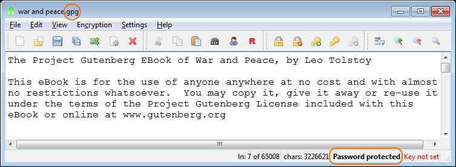
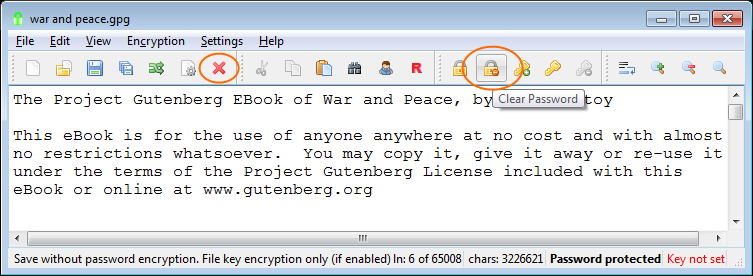

# Открыть простой текст, защитить его с помощью пароля и сохранить в виде GPG файла

We are going to open a plain text file, protect it with a password and save as a GPG file.

## Open a plain text file

1\. Click the Open File tool button

2\. Select Plain Text file type and click Save button

3\. The plain text file opened

Now EncryptPad is in unprotected plain text mode. It works as an ordinary text editor.

## Protect with a password and save as a GPG file

4\. Click the Save As tool button.

5\. Select GnuPG file type and click Save button

Please note that the file name has changed to "war and peace.gpg" in the Save As dialogue.

6\. You will be asked to enter a password twice. Enter `DemoPwd` for this example and click OK.

7\. Now the file has been saved on the disk and it is encrypted with our password. See the file extension and the status on the picture below.

## The GPG file on disk

It is an Open PGP file. You can send it to someone who does not have EncryptPad. It is easily decrypted with [Gpg4Win](https://www.gpg4win.org/) for example.

GPG packet --list-packets command output:

`gpg --list-packets "war and peace.gpg"` 

`:symkey enc packet: version 4, cipher 9, s2k 3, hash 8` 
`        salt 9cd701f1d2e0aca8, count 65536 (96)` 
`gpg: AES256 encrypted data` 
`:encrypted data packet:` 
`        length: 1201175` 
`        mdc_method: 2` 
`gpg: encrypted with 1 passphrase` 
`:compressed packet: algo=2` 
`:literal data packet:` 
`        mode t (74), created 0, name="CONSOLE",` 
`        raw data: unknown length` 

## Update the file

If you modify the text now and click Save tool button, EncryptPad will not ask you to enter the password again because it stores several salted hashes of your password.

## Open another plain text file

If you try to open a plain text file now, it will fail with the following message.

EncryptPad "thinks" that the file is encrypted with a password because its mode is "Password protected" as you can see in the status bar. It tried to decrypt the plain text and failed. To proceed with opening the file, clear password protection by clicking the Clear Password tool button or even better click Close and Reset. The latter will close the text file and reset both parts of the protection.

Now you can open your plain text file.

